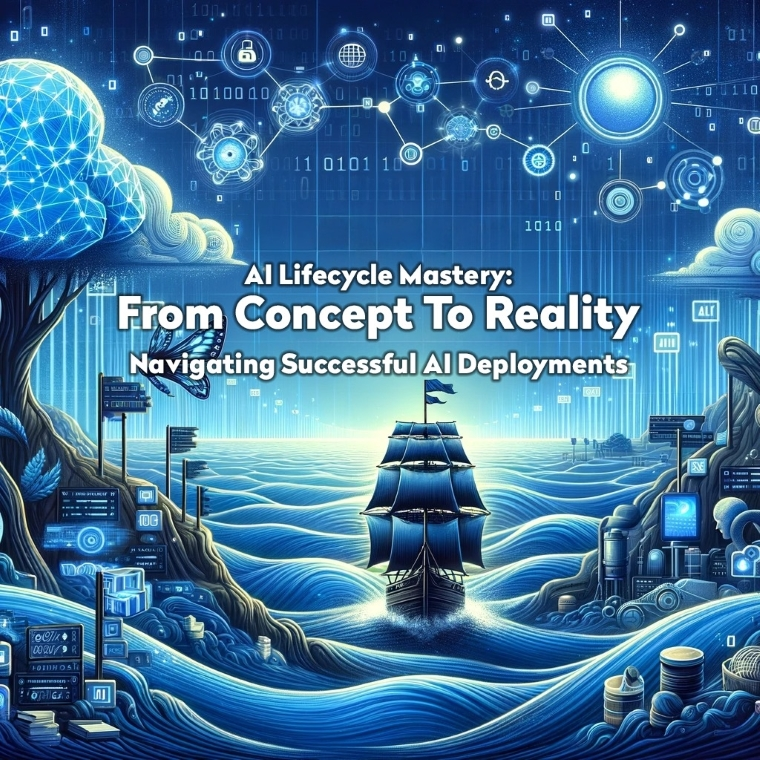

# AI Lifecycle Mastery: From Concept to Reality – Navigating Successful AI Deployments

Welcome to "AI Lifecycle Mastery: From Concept to Reality – Navigating Successful AI Deployments," a comprehensive guide designed to be a central resource for professionals venturing into the world of artificial intelligence with Azure. This guide is not just a brief overview but an extensive, carefully curated collection of chapters, each offering deep insights into a specific aspect of AI project development and deployment using Azure.

**Who This Guide is For:**

This guide is crafted for a diverse range of professionals, including:

- Technical practitioners seeking in-depth knowledge of AI integration.
- Business leaders looking for guidance on the strategic aspects of AI deployments.
- Project managers aiming for effective coordination and implementation of AI projects.

**What You Will Find Inside:**

Structured as a 15-chapter journey, this guide provides:

1. Detailed explorations of Azure's AI services, including practical applications and theoretical underpinnings.
2. A blend of technical guidelines and strategic advice, ensuring a holistic understanding of AI project development.
3. An array of resources, from step-by-step instructions to links for extended learning, catering to both technical and business-oriented readers.

**Our Objective:**

Our aim is to demystify the complexities of AI project development in Azure, offering a clear roadmap from conceptualizing AI solutions to their full-scale deployment. By consolidating Azure AI information and tools, we facilitate a smoother and more efficient integration of AI into your business operations.

**How to Use This Guide:**

- **Navigating the Chapters:** Follow the chapters sequentially for a structured learning path or navigate to specific topics of interest for targeted information.
- **Hands-On Experience:** Utilize the provided links and resources for practical application and deeper exploration.
- **Engage with the Community:** Benefit from the knowledge and experience of the contributors who are seasoned professionals in the field.

## Table of Contents

1. [Chapter 1: Setting Off: Understanding AI's Landscape](chapters/chapter_01_setting_off_understanding_ai_landscape.md)
2. [Chapter 2: Charting the Course: Ideation and Goal Setting](chapters/chapter_02_charting_course_ideation_goal_setting.md)
3. [Chapter 3: Gathering Your Crew: Building the Right Team](chapters/chapter_03_gathering_your_crew_building_right_team.md)
4. [Chapter 4: Mapping the Terrain: Data Management and Ethics](chapters/chapter_04_mapping_terrain_data_management_ethics.md)
5. [Chapter 5: Crafting the Vessel: Design and Development](chapters/chapter_05_crafting_vessel_design_development.md)
6. [Chapter 6: Testing the Waters: Testing and Iteration](chapters/chapter_06_testing_waters_testing_iteration.md)
7. [Chapter 7: Navigating Rough Seas: Performance](chapters/chapter_07_navigating_rough_seas_performance.md)
8. [Chapter 8: Securing the Cargo: Networking & Security](chapters/chapter_08_securing_cargo_networking_security.md)
9. [Chapter 9: Managing the Expedition: Cost Management/Optimization](chapters/chapter_09_managing_expedition_cost_management_optimization.md)
10. [Chapter 10: Weatherproofing the Journey: Reliability/High Availability](chapters/chapter_10_weatherproofing_journey_reliability_high_availability.md)
11. [Chapter 11: Expanding Horizons: Scaling & Quota Management](chapters/chapter_11_expanding_horizons_scaling_quota_management.md)
12. [Chapter 12: Keeping a Log: Observability](chapters/chapter_12_keeping_log_observability.md)
13. [Chapter 13: Building for Everyone: Multitenant Architecture](chapters/chapter_13_building_for_everyone_multitenant_architecture.md)
14. [Chapter 14: Arrival: Deployment Strategies](chapters/chapter_14_arrival_deployment_strategies.md)
15. [Chapter 15: Continuing the Voyage: Monitoring and Maintenance](chapters/chapter_15_continuing_voyage_monitoring_maintenance.md)

## Building and Previewing the Guide Locally

Assuming [Ruby 3.3](https://github.com/rbenv/rbenv), [Bundler, and Jekyll](https://jekyllrb.com/) are installed on your machine, follow these steps to build and preview the guide locally.

> [!NOTE]
> Jekyll is not officially supported for Windows. For more information, see "[Jekyll on Windows](https://jekyllrb.com/docs/installation/windows/)" in the Jekyll documentation.

1. Change your working directory to the root of this repository.
2. Run `bundle` to install all necessary dependencies.
3. Run `./run.sh` to build the guide site and start the Jekyll server.
4. Preview the guide at `http://localhost:4000/AI-in-Production-Guide/`.

The built site is stored in the directory `_site`.

## Contributors

The content and resources in this guide have been curated by the following original contributors.

- Sofia Ferreira - Customer Engineer - Microsoft
- Yoav Dobrin - Principal Customer Engineer - Microsoft
- James Croft - Customer Engineer - Microsoft
- Olga Molocenco-Ciureanu - Customer Engineer - Microsoft
