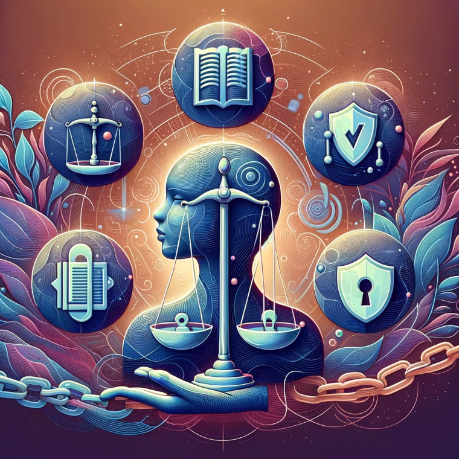

# Chapter 5: Crafting the Vessel: Design and Development

This chapter is dedicated to the design and development phase of AI projects, a specialized realm within the broader spectrum of software development. While AI-driven projects are fundamentally software endeavors, they present unique challenges and require distinct methodologies, tools, and best practices. Our objective in this chapter is to guide you through these specific aspects, showcasing how to efficiently translate AI concepts into functional and robust solutions. We place a particular focus on harnessing Azure's tools and services to facilitate this journey.

AI-driven projects, although a subset of software projects, diverge significantly in their approach. They are characterized by a data-centric nature, iterative model development and training, and an emphasis on continuous learning and adaptation. To better understand these differences, let's begin with a comparative table that highlights the key contrasts between AI-driven and traditional software development:

| Aspect              | AI-Driven Software                                                                                              | Non-AI Software                                                                                                  |
|---------------------|-----------------------------------------------------------------------------------------------------------------|------------------------------------------------------------------------------------------------------------------|
| Requirement Gathering | Focus on data requirements, AI feasibility, and problem-specific considerations.                               | Emphasis on functional and non-functional requirements, user needs.                                              |
| Team Composition | Requires interdisciplinary teams with data scientists, machine learning engineers, software developers, domain experts, and potentially DevOps specialists. | Primarily composed of software developers with expertise in specific programming languages and frameworks. |
| Design                | Involves selecting machine learning models, data processing methods, and integration strategies.                | Focused on software architecture, user interfaces, and system interactions.                                      |
| Timelines | Development timelines can be flexible and iterative due to model training and feedback loops. Expect potential data acquisition and labeling delays. | Timelines tend to be more fixed and predictable, following traditional development phases and milestones. |
| Implementation        | Includes data preprocessing, model training, and hyperparameter tuning. Experimental and iterative.             | Straightforward coding based on design specifications. Predictable.                                               |
| Testing               | Validates AI model accuracy, biases, and robustness, in addition to traditional software testing.               | Focuses on finding bugs and ensuring the software meets specified functional requirements.                        |
| Deployment            | Includes model deployment, requiring different infrastructure, and continuous model performance monitoring.    | Generally straightforward, making the software available in the intended environment.                             |
| Maintenance           | Regular updates to the model, monitoring for model drift, improving performance.                               | Updating for new features, bug fixes, and external environment changes.                                          |
| Risk Management | Requires proactive mitigation strategies for data security, privacy concerns, and potential bias in models. Explainability and responsible AI practices are crucial. | Risks primarily focus on traditional software development challenges like coding errors, performance issues, and security vulnerabilities. |
| Lifecycle Iteration   | More iterative, with frequent adjustments in implementation, testing, and deployment phases.                   | More linear or incremental, with distinct phases.                                                               |

Throughout this chapter, we will deep dive into each of these aspects, equipping you with the knowledge and skills to navigate the nuanced world of AI-driven software development, particularly in the context of Azure's ecosystem.

**References**:

For further reading and a more detailed exploration of these topics, you may refer to these articles:

- **AI vs. Traditional Software by Belitsoft**: The article on Belitsoft's website, ["Artificial Intelligence vs. Conventional Software"](https://belitsoft.com/ai-development/artificial-intelligence-vs-conventional-software), delineates the key difference between AI software and conventional software. AI systems are designed to learn from data and adapt autonomously, contrasting with traditional software that operates on fixed instructions and requires human intervention for updates. The page breaks down AI software into three primary components: data, algorithms, and patterns. Data, as the cornerstone of AI, demands collection, labeling, and analysis. Algorithms are employed to discern patterns in data, enabling predictions or recommendations. Patterns represent typical scenarios AI can address, such as recognition or anomaly detection.
- **AI Software Development Life Cycle by DevTeam.Space**: The article ["AI Software Development Life Cycle Explained"](https://www.devteam.space/blog/ai-software-development-life-cycle-explained/) on DevTeam.Space outlines the stages and best practices in developing AI solutions, covering everything from initial project scoping to ongoing maintenance. It details various AI capabilities like machine learning, natural language processing, vision, and speech, and introduces popular AI development platforms including IBM Watson, Google Cloud AI, and Microsoft Azure AI. The page also sheds light on the unique challenges and critical considerations in AI development, such as ensuring data quality, effective testing, deployment strategies, and seamless integration.

## Conceptualizing AI Solutions

The journey of AI development begins with a solid conceptual foundation, laying the groundwork for successful and impactful AI solutions. In this section, we explore various facets of conceptualizing AI projects, from the intricacies of building enterprise-grade AI applications to understanding how AI capabilities can transform organizational dynamics. These resources provide valuable insights for anyone embarking on the AI development journey, offering guidance on design thinking, model selection, and the broader implications of AI on organizational performance and creativity.

- **Building Enterprise-Grade Generative AI with Azure**: Dive into the [Enterprise Generative AI Application Lifecycle with Azure AI](https://azure.microsoft.com/en-us/blog/building-for-the-future-the-enterprise-generative-ai-application-lifecycle-with-azure-ai/) for a thorough guide on creating impactful generative AI applications. This resource covers everything from user-centric design thinking to selecting and optimizing generative models like GANs and VAEs. It also highlights Azure's suite of tools such as Machine Learning, Databricks, and Cognitive Services, and discusses responsible AI practices. Ideal for those looking to leverage Azure for advanced AI development.

- **Exploring AI's Impact on Organizations**: Uncover insights from the research article, "[Artificial intelligence capability: Conceptualization, measurement calibration, and empirical study on its impact on organizational creativity and firm performance](https://www.sciencedirect.com/science/article/pii/S0378720621000082)," which investigates how AI capabilities influence organizational creativity and performance. The study introduces a framework to measure AI capability, differentiating between basic and advanced levels, and reveals that advanced AI capabilities notably enhance organizational creativity. It underscores the role of leadership support and human-AI collaboration as moderating factors. This research is crucial for managers aiming to leverage AI strategically, emphasizing the need for an innovative culture and effective human-AI collaboration to amplify AI's positive impact on organizational outcomes.

## Selecting and Optimizing Models

The selection and optimization of models stand as pivotal steps in developing robust AI systems. This section provides a guided exploration into the art and science of choosing and fine-tuning AI models, specifically within the Azure and OpenAI frameworks. Whether you're an experienced AI developer or just starting out, these resources offer insights into critical aspects of AI model development. From fine-tuning techniques in Azure OpenAI to understanding the expansive landscape of foundation models, and from navigating the diverse models offered by OpenAI to strategically selecting algorithms in Azure ML, this collection is designed to equip you with the knowledge and tools necessary for optimizing your AI solutions. Embrace this opportunity to refine your skills and insights in the nuanced field of AI model optimization.

- **Fine-Tuning AI Models with Azure OpenAI**: Enhance your AI development skills by exploring the guide, "[Fine-Tuning Considerations for Azure OpenAI](https://learn.microsoft.com/en-us/azure/ai-services/openai/concepts/fine-tuning-considerations)." This resource is key for developers and data scientists looking to fine-tune their AI models using Azure OpenAI services. It offers valuable insights into the nuances of model fine-tuning, covering critical considerations and best practices to optimize your AI solutions. Ideal for those seeking to achieve more precise and effective results from their AI models, this guide provides a clear pathway to mastering the art of fine-tuning in the Azure AI ecosystem.
- **Azure Foundation Models Overview**: Dive into the world of large-scale AI models with "[Foundation Models in Azure Machine Learning](https://learn.microsoft.com/en-us/azure/machine-learning/concept-foundation-models?view=azureml-api-2)." This comprehensive guide is essential for those interested in understanding and working with foundation models in Azure. It provides a detailed overview of what foundation models are, their significance in AI, and how they can be leveraged within Azure Machine Learning. Whether you're a seasoned data scientist or new to machine learning, this resource offers valuable insights into the capabilities and applications of foundation models, helping you to harness their potential effectively in your AI projects.
- **Guide to OpenAI Models**: Explore the capabilities and variety of AI models offered by OpenAI in their detailed documentation, "[OpenAI Models Guide](https://platform.openai.com/docs/models)." This resource is invaluable for developers and AI enthusiasts looking to understand the different types of models available on the OpenAI platform, including their features, use cases, and implementation details. It's an essential read for anyone planning to integrate OpenAI's cutting-edge models into their applications, offering a thorough understanding of each model's strengths and how to effectively utilize them in various AI-driven projects.
- **Choosing the Right Algorithms in Azure ML**: Gain insights on selecting the most effective machine learning algorithms for your projects with Azure's guide, "[How to Select Algorithms for Azure Machine Learning](https://learn.microsoft.com/en-us/azure/machine-learning/how-to-select-algorithms?view=azureml-api-1)." This resource is crucial for data scientists and AI developers who want to make informed decisions about algorithm selection in Azure Machine Learning. It provides a clear framework for understanding different types of algorithms, their applications, and how to match them with specific data types and problem statements. This guide is a valuable tool for optimizing your machine learning models, ensuring that you choose the right algorithms to drive accuracy and efficiency in your AI solutions.

> In the realm of machine learning, GANs, VAEs, and transformers each play a unique and transformative role. GANs, akin to dueling artists, excel in creating realistic images and content through competitive refinement. VAEs are like keepers of a treasure chest, expertly compressing and reconstructing data, valuable for tasks like image manipulation. Transformers, on the other hand, act as adept translators, mastering language processing by understanding intricate word relationships, making them essential for tasks like text generation and translation. Each of these AI technologies brings its own form of innovation to the field of machine learning.

## Designing for Performance and Scalability

Designing for performance and scalability is a critical aspect of modern cloud architecture and AI development. This section brings together essential resources that guide you through the nuances of building high-performing and scalable solutions on Azure. From understanding performance efficiency principles to grasping the complexities of AI and ML architectures, these resources provide important insights into designing systems that are not only powerful but also adept at handling growth and varying workloads.

- **Mastering Performance Efficiency in Azure**: Enhance your understanding of performance efficiency with Azure's guide, "[Principles of Performance Efficiency](https://learn.microsoft.com/en-us/azure/well-architected/performance-efficiency/principles)." This resource is pivotal for anyone looking to optimize their Azure-based applications and services. It delves into key principles that underpin performance efficiency, offering insights and strategies to ensure your Azure deployments not only meet but exceed performance expectations. Whether you're a developer, an architect, or a cloud strategist, this guide provides the foundational knowledge and practical tips needed to make the most of Azure's capabilities in delivering high-performing, efficient solutions.
- **Understanding AI and ML on Azure**: For an in-depth exploration of Artificial Intelligence and Machine Learning on Azure, visit "[Azure AI and Machine Learning Architecture](https://learn.microsoft.com/en-us/azure/architecture/ai-ml/)." This comprehensive guide is an essential resource for anyone looking to delve into the AI and ML capabilities offered by Azure. It covers architectural best practices, design patterns, and strategies to effectively implement AI and ML solutions using Azure's diverse range of services and tools. Ideal for architects, developers, and data scientists, this guide helps you navigate the complexities of AI and ML projects, ensuring you can leverage Azure's full potential to create innovative, efficient, and scalable solutions.
- **Scaling Generative AI with Azure**: Discover the latest advancements in Azure AI infrastructure for scaling generative AI in the blog post "[Scale Generative AI with New Azure AI Infrastructure Advancements and Availability](https://azure.microsoft.com/en-us/blog/scale-generative-ai-with-new-azure-ai-infrastructure-advancements-and-availability/)." This article is a must-read for professionals working with generative AI, providing insights into Azure's newest infrastructure developments that enhance the scalability and efficiency of AI models. It discusses key updates and availability details, making it a valuable resource for anyone looking to expand their generative AI projects using Azure's cutting-edge AI capabilities. Whether you're a data scientist, AI developer, or IT professional, this post will keep you informed about the latest trends and technologies in the Azure AI landscape.
- **Azure Scale-Out Design Principles**: Deepen your understanding of scalability in cloud architecture with the resource "[Scale Out - Cloud Design Patterns](https://learn.microsoft.com/en-us/azure/architecture/guide/design-principles/scale-out)." This guide is crucial for architects and developers looking to design scalable systems on Azure. It provides a detailed exploration of scale-out patterns, offering strategies to handle increased load by distributing it across multiple instances. The resource explains how to effectively apply these patterns in Azure environments, ensuring your applications are not only scalable but also resilient and efficient. This is an invaluable read for those aiming to create robust, scalable cloud solutions with Azure.
- **Design Thinking for AI Solutions:**: The concept of design thinking and its importance in AI development. [Azure Design Thinking Toolkit](https://learn.microsoft.com/en-us/azure/architecture/guide/design-principles/)

## Collaborative Development and DevOps

In today's rapidly evolving tech landscape, the fusion of collaborative development and DevOps practices, particularly in the realm of AI and machine learning, has become a cornerstone for success. This section brings together an array of resources designed to enhance your understanding and implementation of these practices. From maximizing the potential of large language models to navigating the intricacies of AI risk management, these resources provide valuable insights into the latest developments and best practices in collaborative AI development and MLOps.

- **Maximizing LLMs with Azure LLMOps**: Explore the transformative potential of large language models (LLMs) in the Azure blog post, "[The New AI Imperative: Unlock Repeatable Value for Your Organization with LLMOps](https://azure.microsoft.com/en-us/blog/the-new-ai-imperative-unlock-repeatable-value-for-your-organization-with-llmops/)." This insightful piece advocates for LLMOps, a strategic approach to managing and deploying LLMs on Azure. Learn how to streamline development, optimize performance, and embrace responsible AI principles, ensuring your LLM investments yield consistent and impactful business results. The article highlights the pivotal role of Azure Machine Learning and Azure DevOps in enhancing the LLMOps lifecycle and emphasizes the importance of collaboration and knowledge sharing for successful LLM initiatives.

- **Risk Management in the AI Era with Azure OpenAI Service**: Venture into the world of AI risk management with the Azure blog, "[Navigating Risk Management with Azure OpenAI Service](https://azure.microsoft.com/en-us/blog/future-proof-navigating-risk-management-with-azure-openai-service/)." This enlightening article highlights the critical need for an "AI risk-aware mindset" and presents Azure's advanced tools and best practices to tackle AI challenges. Learn about the Azure Machine Learning Fairness Toolkit for addressing data bias, the use of explainable AI (XAI) for transparency, and Azure's robust security infrastructure for data protection. The post also discusses the importance of model drift monitoring and adaptability using Azure Machine Learning AutoML. By showcasing how Azure OpenAI Service lays the foundation for responsible AI development, the blog guides organizations to proactively manage risks, build stakeholder trust, and ensure continuous improvement and adaptability of AI models. It's an essential read for those seeking to navigate the AI landscape responsibly and sustainably with Azure's support.

### MLOps

- **Microsoft Azure MLOps Documentation**: Familiarize yourself with the core concepts and best practices for MLOps using Microsoft Azure's resources. Visit the [Official Azure MLOps documentation](https://learn.microsoft.com/en-us/azure/machine-learning/how-to-devops-machine-learning?view=azureml-api-2), explore the [MLOps in Azure Machine Learning service](https://learn.microsoft.com/en-us/azure/machine-learning/tutorial-deploy-model?view=azureml-api-2), and learn about [Azure DevOps for MLOps](https://learn.microsoft.com/en-us/azure/machine-learning/how-to-devops-machine-learning?view=azureml-api-2) for comprehensive insights.

#### Articles and Tutorials

- **"MLflow for MLOps"**: Enhance your MLOps knowledge with insights from this detailed article on managing machine learning life cycles using MLflow. Read more at [Managing Machine Learning Life Cycle with MLflow](https://medium.com/analytics-vidhya/managing-machine-learning-life-cycle-with-mlflow-3bea291d771b).
- **"A Beginner's Guide to MLOps"**: Perfect for newcomers to MLOps, this guide provides an accessible introduction. Check out [MLOps Guide](https://mlops-guide.github.io/).
- **"Building an MLOps Pipeline with Kubeflow"**: Dive into the specifics of enhancing Kubeflow with MLflow for an efficient MLOps pipeline. Learn more from [Enhancing Kubeflow with MLflow](https://medium.com/geekculture/enhancing-kubeflow-with-mlflow-8983373d0cac).

#### Sample MLOps Projects

- **MLflow Model Serving Demo**: Witness MLOps in action with this informative MLflow model serving demonstration on YouTube: [MLflow Model Serving Demo](https://www.youtube.com/watch?v=A1NERf_8wwA).
- **Kubeflow Pipelines Tutorial**: Expand your practical knowledge of MLOps with Kubeflow's official pipelines tutorial: [Kubeflow Pipelines Tutorial](https://www.kubeflow.org/docs/components/pipelines/v1/tutorials/).
- **Start MLOps with yodobrin/mlops-v2**: Dive into MLOps using the [yodobrin/mlops-v2](https://github.com/yodobrin/mlops-v2) GitHub repository. It provides a practical approach to MLOps using Azure Machine Learning CLI V2 and GitHub Actions. Follow the clear setup instructions to train and deploy models using Azure ML, making it ideal for those new to MLOps.

## Responsible AI Design

As we navigate the evolving landscape of artificial intelligence, it becomes imperative to ground our progress in the principles of responsible AI. This section presents a curated selection of resources that explore the multifaceted aspects of ethical AI development. These resources provide insights into how we can embed fairness, transparency, accountability, privacy, and safety into AI systems, ensuring they are not only technologically advanced but also ethically sound and socially responsible.

_Abstract representation of the five pillars of Responsible AI: Fairness,Transparency, Accountability, Privacy, and Safety, each a cornerstone in ethical AI development._

- **Embedding Ethics in LLMOps with Azure**: Delve into the crucial integration of responsible AI principles in LLMOps with the Azure blog, "[Infuse responsible AI tools and practices in your LLMOps](https://azure.microsoft.com/en-us/blog/infuse-responsible-ai-tools-and-practices-in-your-llmops/)." This essential read underscores the significance of building safe, reliable, and unbiased large language models (LLMs). Discover Azure's advanced tools for continuous model monitoring, ensuring your LLMs remain attuned to evolving social norms and data trends. Learn about technologies like Prompt Flow that enhance groundedness and explainability in LLM outputs. The post also covers Azure’s robust data governance and security features, essential for ethical AI practices, and how Azure aligns with enterprise-level controls for data privacy and compliance. This resource is a gateway to understanding how LLMOps on Azure can lead not just to compliance but to the creation of LLMs that are truly ethical, impactful, and beneficial for organizations.
- **Navigating Ethics in AI with Faraz Mubeen**: Delve into the complexities of ethical AI development in Faraz Mubeen's insightful Medium article, "[Ethical Considerations in AI Development: Striking a Balance between Progress and Responsibility](https://medium.com/@farazmubeen902/ethical-considerations-in-ai-development-striking-a-balance-between-progress-and-responsibility-13b5a0ca1eec)." This thought-provoking piece explores critical challenges like bias, transparency, privacy, and human oversight in AI systems. It advocates for a balanced approach that aligns technological advancement with ethical responsibility. Key solutions proposed include implementing ethical frameworks, prioritizing human values, encouraging public awareness, and fostering responsible AI ecosystems. Ideal for readers seeking guidance on building AI technologies that honor human values while advancing progress, the article encourages an ongoing dialogue and collaborative efforts to shape a more ethical future in AI development.
- **Exploring AI Ethics with Shamili Maria Peter**: In "[The Ethics of Artificial Intelligence: Striking a Balance between Progress and Responsibility](https://medium.com/@shamilimpeter/the-ethics-of-artificial-intelligence-striking-a-balance-between-progress-and-responsibility-11f74e4a4b3d)," Shamili Maria Peter critically examines the ethical landscape of AI development. This Medium article underscores the need for a balanced approach that addresses both the technological potential and the ethical challenges of AI. It covers crucial concerns like job displacement, privacy, algorithmic bias, and the weaponization of AI. The article proposes strategies for responsible development, including transparency, human oversight, diversity, and strong regulatory frameworks. It emphasizes the importance of public awareness, international cooperation, and prioritizing human well-being to ensure that AI advancements benefit humanity as a whole. A must-read for those navigating the complex ethical dimensions of AI, this piece calls for proactive collaboration and dialogue to shape a future where AI serves as a positive force in society.
- **Embracing Ethical AI with Appinventiv**: Delve into the essentials of ethical AI in the Appinventiv blog, "[Responsible AI Principles](https://appinventiv.com/blog/responsible-ai-principles/)." This insightful post underscores the importance of developing and implementing AI responsibly, focusing on fairness, transparency, and accountability. It discusses key principles such as ensuring AI systems' transparency, eliminating bias for fair outcomes, maintaining privacy and security, and upholding developer and user accountability. The blog also highlights the critical role of human oversight in AI decision-making. With an emphasis on the positive impacts of responsible AI in society and innovation, it calls for a collaborative approach involving developers, policymakers, and the public. The article also explores tools and best practices, particularly from Microsoft Azure, to support responsible AI throughout its lifecycle. It's a comprehensive guide for anyone looking to integrate ethical practices in AI development for a safer and more beneficial AI future.

## Key Takeaways and Actionable Strategies for AI Implementation

This chapter provides a comprehensive overview of the unique challenges and methodologies involved in AI-driven software development. It emphasizes the importance of understanding the differences between AI and traditional software projects, with a focus on Azure's tools and services. The chapter covers a wide range of critical topics, from conceptualizing AI solutions to selecting and optimizing models, designing for performance and scalability, and integrating collaborative development with DevOps practices, all while ensuring responsible AI design.

For CTOs, Development Leads, and Chief Architects, the following recommendations are crucial:

1. **Embrace Specialized AI Development Methodologies**:
   - Understand and apply the distinct approaches required for AI-driven software development, including the need for interdisciplinary teams, data-centric designs, and iterative development cycles.

2. **Utilize Azure's AI Tools and Services Effectively**:
   - Leverage Azure’s AI services for model selection, optimization, and deployment. Utilize Azure Machine Learning, Databricks, and Cognitive Services to enhance the development process.
   - Incorporate Azure’s resources for training and fine-tuning AI models, focusing on performance, scalability, and responsible AI practices.

3. **Focus on Ethical AI Development**:
   - Prioritize ethical considerations in AI development, ensuring transparency, fairness, privacy, and accountability in AI systems.
   - Stay informed about the latest advancements in ethical AI and integrate these practices into all stages of AI development.

4. **Integrate Collaborative Development and DevOps**:
   - Implement collaborative development and DevOps practices, such as MLOps, to enhance efficiency and agility in AI project development.
   - Utilize Azure's infrastructure advancements for scaling generative AI and ensure continuous model monitoring and risk management.

By following these strategies, organizations can efficiently navigate the complexities of AI-driven software development, ensuring their projects are not only technologically advanced but also ethically responsible and aligned with their business goals.
